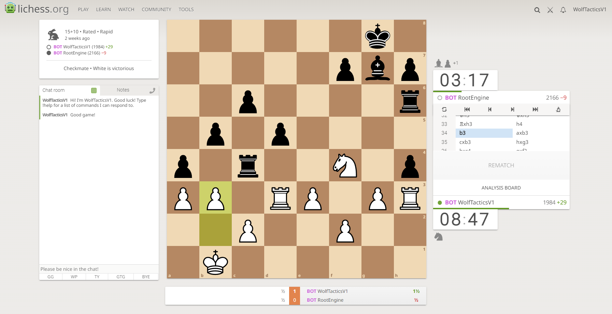

# Chess-Engine
A C++ UCI protocol chess engine. This chess engine makes use of the Minimax search algorithm with alpha-beta pruning and other extentions. The binary executable is found in the Release folder and is ready to be installed into a chess GUI. Accepts challenges on lichess.org under the alias WolfTacticsV1. Minimax search features are listed below.

# Features:
Bitboard Data Structures \
Magic Bitboards \
Killer Moves \
History Moves \
Quiescence Search \
Principal Variation/Iterative Deepening \
Principal Variation Search \
Late Move Reduction \
Null Move Pruning \
Transposition Table

# Building:
The .sln file can be used to build the project in Visual Studio 2022. Be sure to use Release Mode and that compiler optimizations are turned on.
